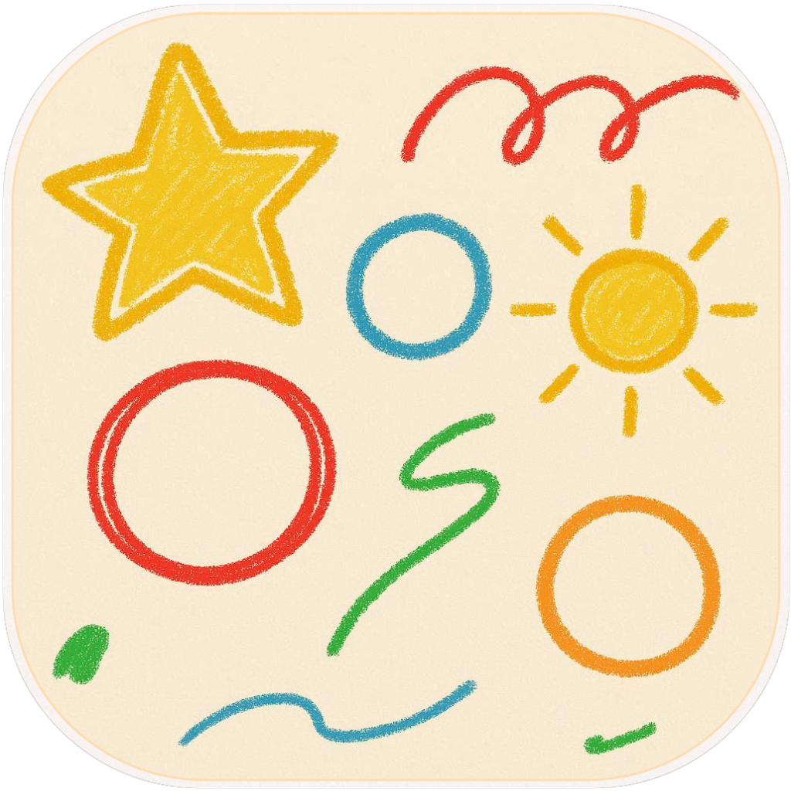

<h1>&emsp;Hayagaki (速描き)</h1><br>
<br clear="left"/>

**Hayagaki** ("Fast Drawing") is a high-performance, offline-first rendering engine built for Apple Silicon. It bridges raw C++ physics with modern Swift/Metal graphics to create a cinematic model viewer that renders directly to video memory.

> "A lightweight, bindless Metal engine designed for programmatic content generation."

## ✨ Features

* **Bindless Metal Pipeline**: Uses Argument Buffers (Tier 2) for zero-overhead resource binding.
* **Offline Rendering Core**: Renders directly to `CVPixelBuffer` via `CVMetalTextureCache` for 1080p H.264 output with zero CPU copies.
* **Programmatic Asset Management**: Automatically downloads, validates (SHA256), and caches assets (OBJ/PLY) from remote sources.
* **ModelIO Integration**: robustly handles vertex attributes, normal generation, and UV unwrapping for raw scan data.
* **libsumi Physics**: Custom C++ linear algebra library bridged to Swift for high-performance math.
* **Interactive Camera**: Smooth, damped orbital controls (Arcball-ish) with scroll-wheel zoom.

## 🚀 Quick Start

### Prerequisites
* macOS 14.0+ (Apple Silicon recommended)
* Xcode 15+ (for Metal 3.0 features)

### Build & Run
The engine is self-contained. It will automatically download test assets (Stanford Bunny) on first run.

```bash
# Clone the repository
git clone https://github.com/crux161/hayagaki.git
cd hayagaki
./build.sh
```

